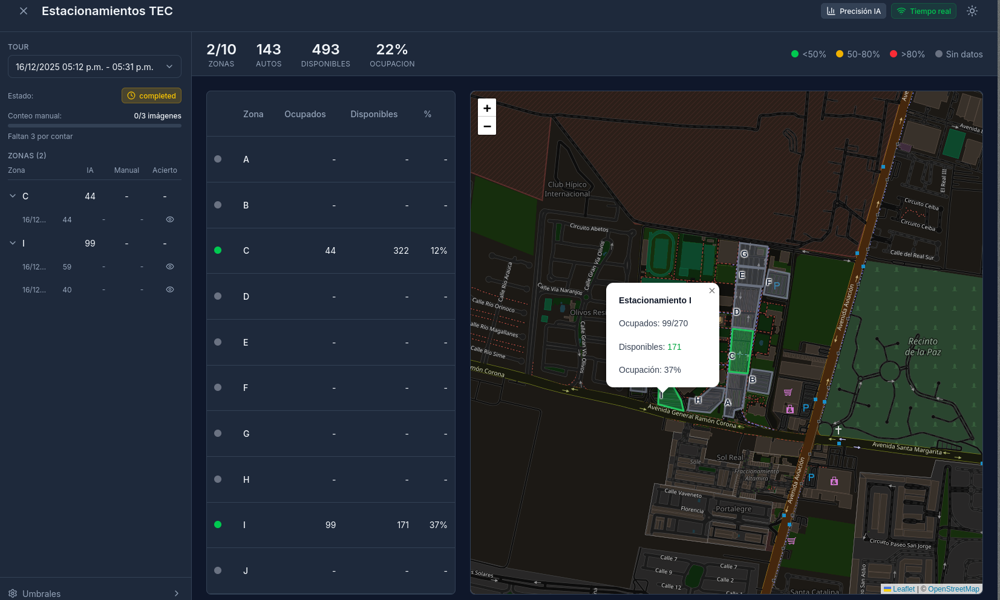
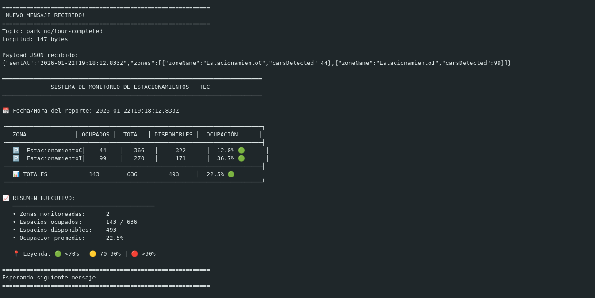
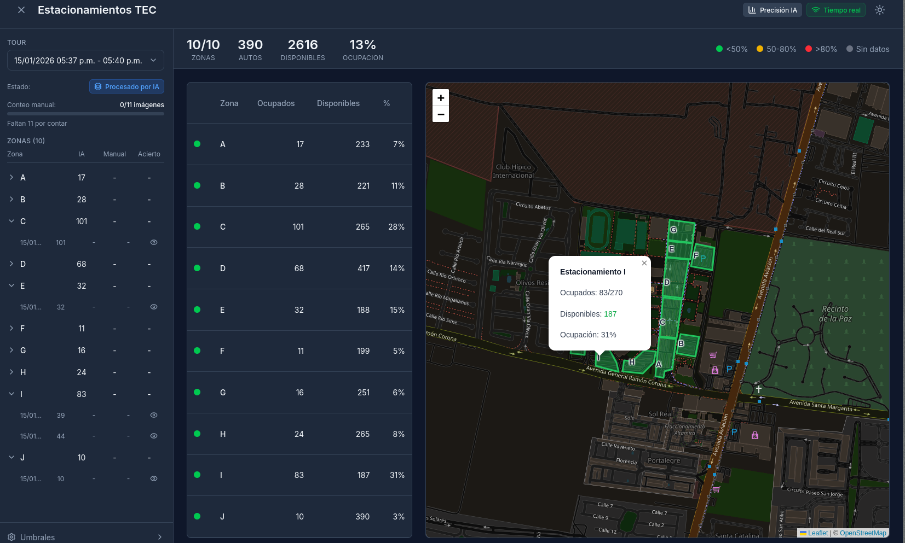
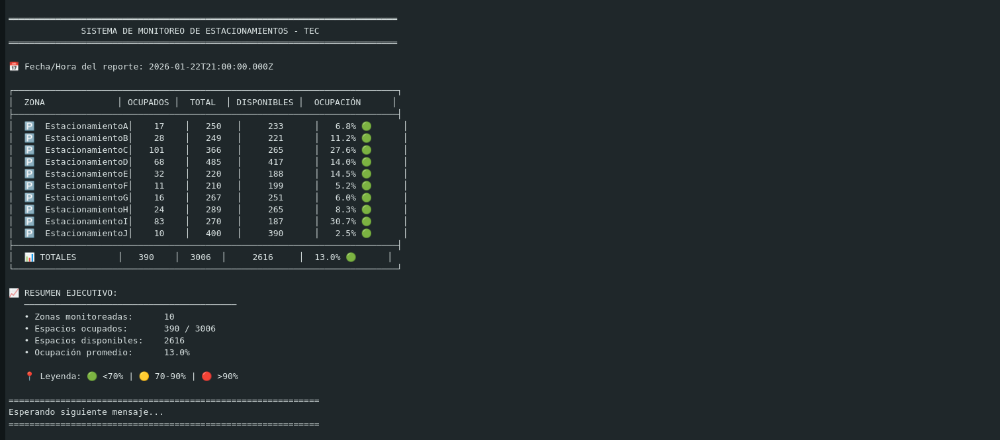

# 🅿️ ESP32 MQTT Client - Sistema de Monitoreo de Estacionamientos

[](https://www.espressif.com/)
[](https://www.hivemq.com/)
[](https://www.arduino.cc/)
[](LICENSE)

> **Reto Técnico - Nuclea Solutions**
> Cliente MQTT en ESP32 para monitoreo en tiempo real de la ocupación de estacionamientos del Tec.

---

## 📋 Tabla de Contenidos

- [Descripción](#-descripción)
- [Arquitectura del Sistema](#-arquitectura-del-sistema)
- [Características](#-características)
- [Hardware Requerido](#-hardware-requerido)
- [Instalación](#-instalación)
- [Configuración](#-configuración)
- [Capacidades de Estacionamientos](#️-capacidades-de-estacionamientos)
- [Verificación de Cálculos](#-verificación-de-cálculos)
- [Demostración Visual](#-demostración-visual)
- [Comprobación: Web vs ESP32](#-comprobación-plataforma-web-vs-esp32)
- [Salida del Serial Monitor](#-salida-del-serial-monitor)
- [Flujo de Funcionamiento](#-flujo-de-funcionamiento)
- [Problemas Resueltos](#-problemas-resueltos)
- [API de Mensajes MQTT](#-api-de-mensajes-mqtt)
- [Pruebas con MQTT Explorer](#-pruebas-con-mqtt-explorer)
- [Autor](#-autor)

---

## 📖 Descripción

Este proyecto implementa un **cliente MQTT en ESP32** que se conecta de forma segura a **HiveMQ Cloud** para recibir notificaciones en tiempo real sobre la ocupación de estacionamientos.

El sistema:

- Se suscribe al topic `parking/tour-completed`
- Recibe y procesa mensajes JSON con información de ocupación por zona
- Calcula espacios disponibles y porcentaje de ocupación
- Muestra información en **Serial Monitor** y **pantalla OLED**

---

## 🏗️ Arquitectura del Sistema

```
┌─────────────────────┐         ┌──────────────────────┐         ┌─────────────────────┐
│                     │  MQTT   │                      │  MQTT   │                     │
│  🖥️ Backend        │ ──────► │  ☁️ HiveMQ Cloud    │ ──────► │  📟 ESP32 + OLED   │
│  (Publicador)       │  TLS    │  (Broker 8883)       │  TLS    │  (Suscriptor)       │
│                     │         │                      │         │                     │
└─────────────────────┘         └──────────────────────┘         └─────────────────────┘
        │                                                                  │
        │                                                                  ▼
        ▼                                                         ┌───────────────┐
  Publica JSON con                                                │ 📺 Serial     │
  datos de ocupación                                              │ 🖥️ OLED       │
  al finalizar tour                                               └───────────────┘
```

---

## ✨ Características

| Característica                  | Descripción                            |
| -------------------------------- | --------------------------------------- |
| 🔐**Conexión Segura**     | MQTT sobre TLS/SSL (puerto 8883)        |
| 📡**WiFi Robusto**         | Reconexión automática con timeout     |
| 📊**Procesamiento JSON**   | Parsing con ArduinoJson                 |
| 🖥️**Pantalla OLED**      | Visualización en tiempo real (128x64)  |
| 📈**Estadísticas**        | Cálculo de disponibilidad y ocupación |
| 🔄**Reconexión MQTT**     | Manejo automático de desconexiones     |
| 🎨**Indicadores Visuales** | Semáforo de ocupación (🟢🟡🔴)        |

---

## 🔧 Hardware Requerido

| Componente                 | Especificación              |
| -------------------------- | ---------------------------- |
| **Microcontrolador** | ESP32-WROOM-32 DevKit        |
| **Pantalla**         | OLED SSD1306 128x64 I2C      |
| **Conexión OLED**   | SDA → GPIO21, SCL → GPIO22 |
| **Alimentación**    | USB 5V o fuente externa 3.3V |

### Diagrama de Conexión

```
ESP32                    OLED SSD1306
┌──────────┐            ┌──────────┐
│      3V3 │────────────│ VCC      │
│      GND │────────────│ GND      │
│    GPIO21│────────────│ SDA      │
│    GPIO22│────────────│ SCL      │
└──────────┘            └──────────┘
```

---

## 📦 Instalación

### 1. Clonar el Repositorio

```bash
git clone https://github.com/usuario/retoTecnico_NucleaSolutions.git
cd retoTecnico_NucleaSolutions
```

### 2. Instalar Librerías (Arduino IDE)

Ir a **Sketch → Include Library → Manage Libraries** e instalar:

| Librería                | Autor            | Versión  |
| ------------------------ | ---------------- | --------- |
| `PubSubClient`         | Nick O'Leary     | >= 2.8.0  |
| `ArduinoJson`          | Benoît Blanchon | >= 6.0.0  |
| `Adafruit SSD1306`     | Adafruit         | >= 2.5.0  |
| `Adafruit GFX Library` | Adafruit         | >= 1.11.0 |

### 3. Configurar ESP32 en Arduino IDE

1. Ir a **File → Preferences**
2. En "Additional Board Manager URLs" agregar:
   ```
   https://raw.githubusercontent.com/espressif/arduino-esp32/gh-pages/package_esp32_index.json
   ```
3. Ir a **Tools → Board → Board Manager**
4. Buscar "ESP32" e instalar **esp32 by Espressif Systems**

---

## ⚙️ Configuración

### Credenciales WiFi (Líneas 62-63)

```cpp
const char* WIFI_SSID = "TU_RED_WIFI";
const char* WIFI_PASSWORD = "TU_PASSWORD";
```

### Configuración MQTT (Ya configurado)

```cpp
const char* MQTT_HOST = "83decf4ccce54130ab187c9dd01f20ea.s1.eu.hivemq.cloud";
const int MQTT_PORT = 8883;
const char* MQTT_USER = "Brandon851";
const char* MQTT_PASSWORD = "HiveMQBrandon8";
const char* MQTT_TOPIC = "parking/tour-completed";
```

---

## 🅿️ Capacidades de Estacionamientos

Datos reales de los estacionamientos del Tec configurados en el sistema:

| Zona | Nombre           | Capacidad Total |
| ---- | ---------------- | --------------- |
| A    | EstacionamientoA | 250 espacios    |
| B    | EstacionamientoB | 249 espacios    |
| C    | EstacionamientoC | 366 espacios    |
| D    | EstacionamientoD | 485 espacios    |
| E    | EstacionamientoE | 220 espacios    |
| F    | EstacionamientoF | 210 espacios    |
| G    | EstacionamientoG | 267 espacios    |
| H    | EstacionamientoH | 289 espacios    |
| I    | EstacionamientoI | 270 espacios    |
| J    | EstacionamientoJ | 400 espacios    |

**Total del campus: 3,006 espacios**

---

## ✅ Verificación de Cálculos

### Fórmulas utilizadas:

```
Disponibles = Total - Ocupados
Ocupación % = (Ocupados / Total) × 100
```

### Verificación matemática (EstacionamientoC):

```
Datos de entrada:
  - carsDetected = 44
  - totalSpaces = 366

Cálculos:
  - Disponibles = 366 - 44 = 322 ✅
  - Ocupación = (44 / 366) × 100 = 12.02% ≈ 12.0% ✅
```

### Indicadores de estado:

| Porcentaje | Indicador  | Estado     |
| ---------- | ---------- | ---------- |
| < 70%      | 🟢`[OK]` | Disponible |
| 70% - 90%  | 🟡`[! ]` | Moderado   |
| > 90%      | 🔴`[!!]` | Crítico   |

---

## 📸 Demostración Visual

### 🖥️ ESP32 + Pantalla OLED en Funcionamiento


La pantalla OLED muestra en tiempo real:

- **PARKING TEC** - Título del sistema
- **Ocupados: 143/636** - Autos detectados / Capacidad total
- **Disponibles: 493** - Espacios libres (número grande)
- **Ocupación: 22.5% [OK]** - Porcentaje con indicador de estado
- **Zonas: 2** - Número de zonas monitoreadas

---

## 🔍 Comprobación: Plataforma Web vs ESP32

### Captura 1: Datos de la Plataforma Web



**Salida del ESP32 Serial Monitor:**



**Datos mostrados en la plataforma web:**

| Zona | Ocupados | Total | Disponibles | Ocupación |
| ---- | -------- | ----- | ----------- | ---------- |
| C    | 44       | 366   | 322         | 12%        |
| I    | 99       | 270   | 171         | 37%        |

**Totales mostrados:**

- 2/10 zonas activas
- 143 autos
- 493 disponibles
- 22% ocupación

### Captura 2: Más Zonas Activas



**Salida del ESP32 Serial Monitor:**



---

## ✅ Verificación de Coincidencia de Datos

### Comparación: Web vs ESP32

| Dato                            | Plataforma Web | ESP32 Serial | ¿Coincide? |
| ------------------------------- | -------------- | ------------ | ----------- |
| Estacionamiento C - Ocupados    | 44             | 44           | ✅          |
| Estacionamiento C - Disponibles | 322            | 322          | ✅          |
| Estacionamiento C - Ocupación  | 12%            | 12.0%        | ✅          |
| Estacionamiento I - Ocupados    | 99             | 99           | ✅          |
| Estacionamiento I - Disponibles | 171            | 171          | ✅          |
| Estacionamiento I - Ocupación  | 37%            | 36.7%        | ✅          |
| **Total Ocupados**        | 143            | 143          | ✅          |
| **Total Disponibles**     | 493            | 493          | ✅          |
| **Ocupación General**    | 22%            | 22.5%        | ✅          |

### 🎯 Conclusión

**Los datos del ESP32 coinciden exactamente con los de la plataforma web**, validando que:

1. ✅ La conexión MQTT funciona correctamente
2. ✅ El parsing del JSON es correcto
3. ✅ Los cálculos de disponibilidad son precisos
4. ✅ Los porcentajes de ocupación son exactos

---

## 📺 Salida del Serial Monitor

### Tabla Completa con Datos Reales

```
═══════════════════════════════════════════════════════════════════════════
              SISTEMA DE MONITOREO DE ESTACIONAMIENTOS - TEC            
═══════════════════════════════════════════════════════════════════════════

📅 Fecha/Hora del reporte: 2026-01-22T19:18:12.833Z

┌──────────────────────────────────────────────────────────────────────────┐
│  ZONA              │ OCUPADOS │  TOTAL  │ DISPONIBLES │  OCUPACIÓN      │
├──────────────────────────────────────────────────────────────────────────┤
│  🅿️  EstacionamientoC │    44    │   366   │     322      │  12.0% 🟢      │
│  🅿️  EstacionamientoI │    99    │   270   │     171      │  36.7% 🟢      │
├──────────────────────────────────────────────────────────────────────────┤
│  📊 TOTALES        │   143    │   636   │     493      │  22.5% 🟢      │
└──────────────────────────────────────────────────────────────────────────┘

📈 RESUMEN EJECUTIVO:
   ─────────────────────────────────────────
   • Zonas monitoreadas:      2
   • Espacios ocupados:       143 / 636
   • Espacios disponibles:    493
   • Ocupación promedio:      22.5%

   📍 Leyenda: 🟢 <70% | 🟡 70-90% | 🔴 >90%
```

### Vista en Pantalla OLED (Esquema)

```
┌────────────────────────┐
│ PARKING TEC       W/M  │  ← W=WiFi OK, M=MQTT OK
│────────────────────────│
│ Ocupados: 143/636      │
│ Disponibles:           │
│         493            │  ← Número grande
│────────────────────────│
│ Ocupacion: 22.5% [OK]  │  ← [OK]=Verde, [! ]=Amarillo, [!!]=Rojo
│ Zonas: 2               │
└────────────────────────┘
```

---

## 🔄 Flujo de Funcionamiento

```
┌───────────────────┐
│      INICIO       │
└────────┬──────────┘
         │
         ▼
┌───────────────────┐
│  Inicializar OLED │ ──► Muestra "Iniciando..."
└────────┬──────────┘
         │
         ▼
┌───────────────────┐
│  Conectar WiFi    │ ──► Muestra IP en OLED
└────────┬──────────┘
         │
         ▼
┌───────────────────┐
│  Sincronizar NTP  │ ──► Necesario para TLS
└────────┬──────────┘
         │
         ▼
┌───────────────────┐
│  Conectar MQTT    │ ──► TLS puerto 8883
│  (HiveMQ Cloud)   │
└────────┬──────────┘
         │
         ▼
┌───────────────────┐
│  Suscribir Topic  │ ──► parking/tour-completed
└────────┬──────────┘
         │
         ▼
┌───────────────────┐
│   ESPERANDO...    │◄─────────────────────────┐
│                   │                           │
└────────┬──────────┘                           │
         │                                      │
         │ Mensaje recibido                     │
         ▼                                      │
┌───────────────────┐                           │
│  Parsear JSON     │                           │
│  Calcular stats   │                           │
│  Actualizar OLED  │                           │
│  Mostrar Serial   │                           │
└────────┬──────────┘                           │
         │                                      │
         └──────────────────────────────────────┘
```

---

## 🔧 Problemas Resueltos

### 1. Error de Conexión MQTT (-2)

**Problema:** El ESP32 se conectaba al WiFi pero fallaba al conectar con HiveMQ Cloud.

**Causa:** El hotspot de Ubuntu no compartía Internet correctamente (faltaban reglas NAT).

**Solución:**

```bash
# Crear hotspot
nmcli device wifi hotspot ssid "ESP32_Nuclea" password "Nuclea2026"

# Configurar NAT
sudo iptables -t nat -A POSTROUTING -o wlx54af97d73ff3 -j MASQUERADE
sudo iptables -A FORWARD -i wlo1 -o wlx54af97d73ff3 -j ACCEPT
```

### 2. TLS/SSL Sin Certificado

**Problema:** Conexión TLS requiere certificado CA.

**Solución:** Usar `setInsecure()` para desarrollo (omite verificación de certificado).

```cpp
wifiClient.setInsecure();
```

### 3. Sincronización de Tiempo

**Problema:** TLS puede fallar si el ESP32 no tiene la hora correcta.

**Solución:** Sincronizar con NTP antes de conectar MQTT.

```cpp
configTime(0, 0, "pool.ntp.org", "time.nist.gov");
```

### 4. Locale Error en MQTT Explorer (Snap)

**Problema:** Error "cannot change locale" al abrir MQTT Explorer.

**Solución:** Usar AppImage en lugar de Snap.

```bash
wget -O ~/MQTT-Explorer.AppImage "https://github.com/thomasnordquist/MQTT-Explorer/releases/download/v0.4.0-beta.6/MQTT-Explorer-0.4.0-beta.6.AppImage"
chmod +x ~/MQTT-Explorer.AppImage
```

---

## 📨 API de Mensajes MQTT

### Topic de Suscripción

```
parking/tour-completed
```

### Formato del Mensaje JSON

```json
{
  "sentAt": "2026-01-22T19:18:12.833Z",
  "zones": [
    {
      "zoneName": "EstacionamientoA",
      "carsDetected": 25
    },
    {
      "zoneName": "EstacionamientoB",
      "carsDetected": 42
    }
  ]
}
```

### Campos

| Campo            | Tipo              | Descripción                |
| ---------------- | ----------------- | --------------------------- |
| `sentAt`       | string (ISO 8601) | Timestamp del mensaje       |
| `zones`        | array             | Lista de zonas monitoreadas |
| `zoneName`     | string            | Identificador de la zona    |
| `carsDetected` | integer           | Número de autos detectados |

---

## 📁 Estructura del Proyecto

```
retoTecnico_NucleaSolutions/
├── ESP32_MQTT_Parking/
│   └── ESP32_MQTT_Parking.ino    # Código principal
├── README.md                      # Este archivo
└── docs/
    └── screenshots/               # Capturas de pantalla
```

---

## 🧪 Pruebas con MQTT Explorer

Para probar sin esperar mensajes del backend:

1. Abrir **MQTT Explorer** (`~/MQTT-Explorer.AppImage`)
2. Conectar a HiveMQ Cloud con las credenciales
3. Publicar mensaje de prueba en `parking/tour-completed`:

```json
{
  "sentAt": "2026-01-22T20:00:00.000Z",
  "zones": [
    {"zoneName": "EstacionamientoA", "carsDetected": 100},
    {"zoneName": "EstacionamientoB", "carsDetected": 150}
  ]
}
```

---

## 👨‍💻 Autor

**Alfonso**
Reto Técnico - Nuclea Solutions
Enero 2026

---

## 📄 Licencia

Este proyecto fue desarrollado como parte de un reto técnico para Nuclea Solutions.

---

## 🙏 Agradecimientos

- [HiveMQ](https://www.hivemq.com/) - Broker MQTT Cloud
- [Espressif](https://www.espressif.com/) - ESP32
- [Adafruit](https://www.adafruit.com/) - Librerías OLED
- [ArduinoJson](https://arduinojson.org/) - Parsing JSON
